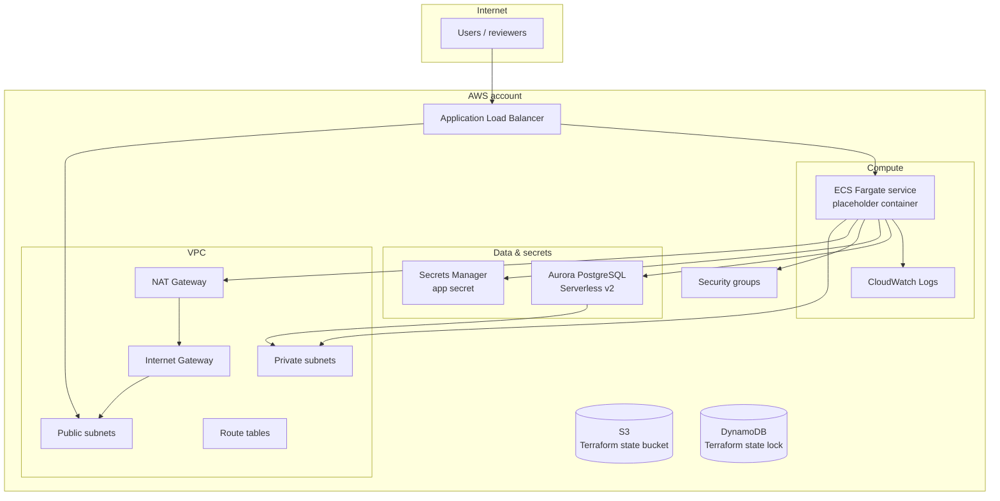

# Architecture (high level)

This diagram describes the **AWS resources provisioned by Terraform** in this repository: **S3** for Terraform state objects (**`terraform/infrastructure/s3_state/`**), networking (root **`terraform/infrastructure/vpc/`**), optional **DynamoDB** for Terraform state locking (**`terraform/infrastructure/dynamodb/`**), data plane, secrets, and a public load balancer to a private ECS service. Extend it when you add the real automation service and deeper observability.

## Legend

- **Public subnets:** ALB endpoints (internet-facing).
- **Private subnets:** ECS tasks and Aurora; outbound via NAT for image pulls and AWS APIs.
- **Security groups:** ALB ↔ ECS (HTTP), ECS → Aurora (PostgreSQL), etc. (see `terraform/modules/security_groups`).
- **Secrets Manager:** Application secret JSON (token) plus RDS-managed master user secret for Aurora.
- **S3:** Bucket for Terraform **`.tfstate`** objects (see `terraform/infrastructure/s3_state/`); configured in each root’s `backend.hcl` as **`bucket`** / **`key`**.  
- **DynamoDB:** Optional regional table (`LockID` key) used by the Terraform **S3 backend** for state locking; not on the application data path (see `terraform/infrastructure/dynamodb/`).

## Source of truth

Resource names, ports, and dependencies are defined in **`terraform/modules/`** and composed in **`terraform/stacks/`**. When the architecture changes, update this Mermaid block (and optionally export a PNG from GitHub’s renderer or a draw.io diagram for reviewers who prefer images).
